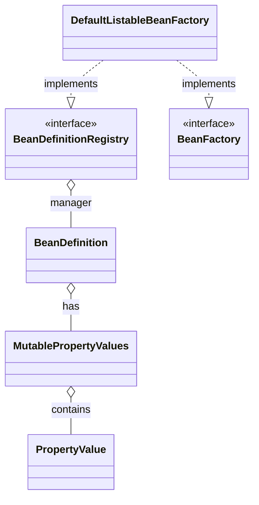
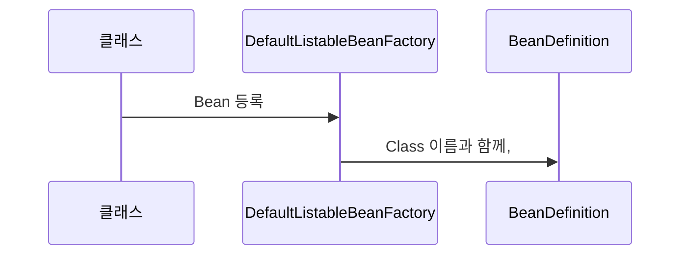

```mermaid
classDiagram
    class PropertyValue
    class MutablePropertyValues
    class BeanDefinition
    class BeanDefinitionRegistry {
        <<interface>>
    }
    class BeanFactory {
        <<interface>>
    }
    class DefaultListableBeanFactory
    
    MutablePropertyValues o-- PropertyValue : contains
    BeanDefinition o-- MutablePropertyValues: has
    BeanDefinitionRegistry o-- BeanDefinition : manager
    
    DefaultListableBeanFactory ..|> BeanFactory : implements
    DefaultListableBeanFactory ..|> BeanDefinitionRegistry : implements
```

```mermaid
    sequenceDiagram
        클래스 ->> DefaultListableBeanFactory: Bean 등록
        DefaultListableBeanFactory ->> BeanDefinition: Class 이름과 함께, 
```
